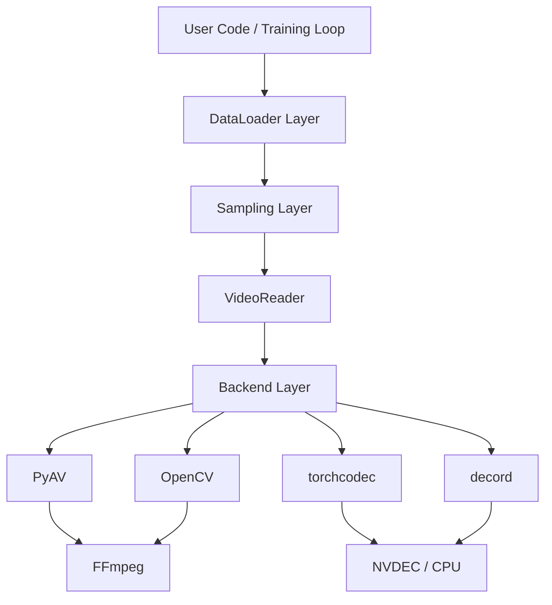
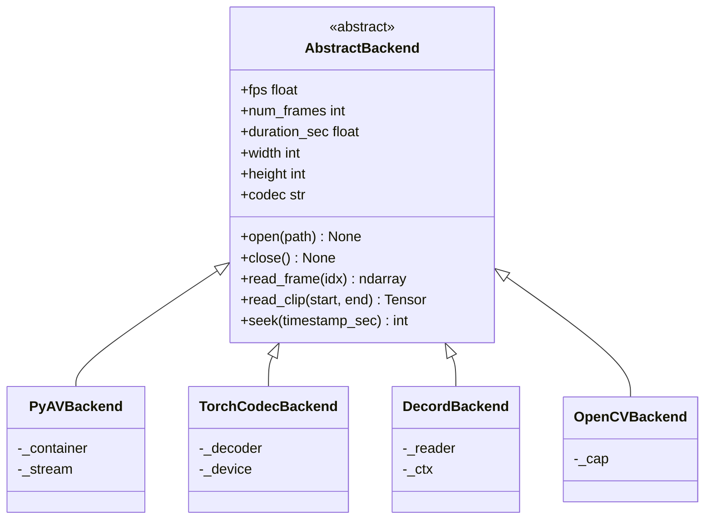
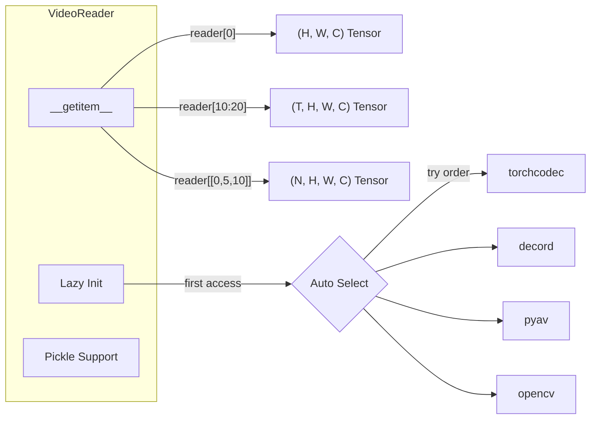
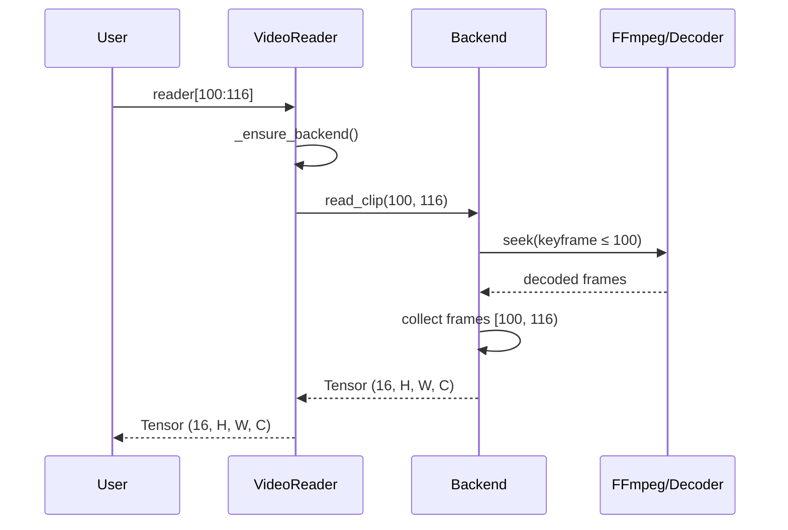
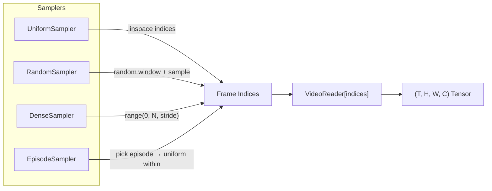
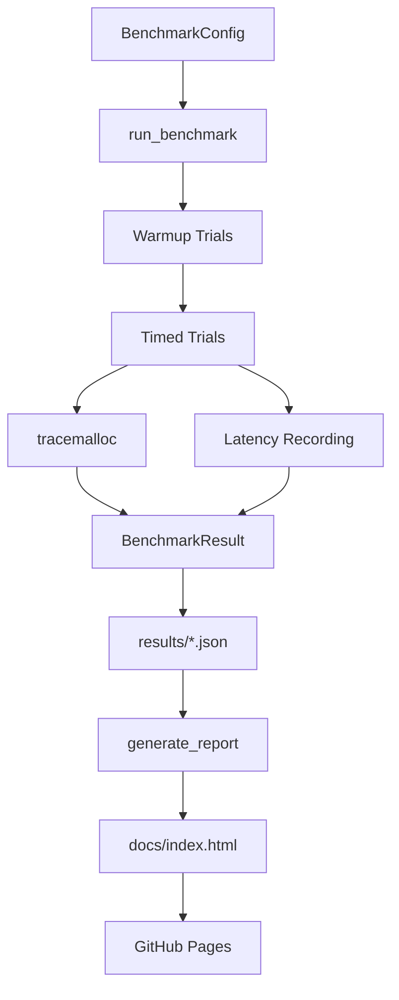

# frameforge Architecture

## System Overview

frameforge provides a unified video decoding/encoding interface designed for robotics foundation model data pipelines. The library is structured as a layered system where each layer builds on the one below it.

## Core Abstractions

### Backend Layer

All backends implement `AbstractBackend`, which enforces a consistent contract for frame access and metadata. The backend is the only layer that touches library-specific APIs.

### VideoReader

The central user-facing class. Wraps any backend behind Pythonic indexing and lazy initialization.

**Key property: worker safety.** The backend is instantiated lazily on first frame access, not at construction time. This means `VideoReader` can be pickled and sent to DataLoader workers without leaking file descriptors across fork boundaries.

## Data Flow

### Single Clip Read

### DataLoader Pipeline

```mermaid
flowchart TD
    VP["video_paths[]"] --> DS[VideoClipDataset]
    DS --> |"per worker"| GI["__getitem__(idx)"]
    GI --> VR["VideoReader (lazy init)"]
    VR --> S["Sampler.sample()"]
    S --> T["transform()"]
    T --> COL["video_collate"]
    COL --> BATCH["(B, T, H, W, C)"]
    BATCH --> MODEL[Model Forward Pass]

    style GI fill:#1a1a2e,stroke:#58a6ff
    style VR fill:#1a1a2e,stroke:#58a6ff
    style S fill:#1a1a2e,stroke:#58a6ff
```

Each worker independently constructs its own `VideoReader` instance inside `__getitem__`. No shared state crosses process boundaries.

## Sampling Strategies

Samplers decouple *what frames to read* from *how to read them*. Every sampler produces frame indices, then delegates the actual I/O to `VideoReader`.

| Sampler | Use Case | Index Strategy |
|---------|----------|---------------|
| Uniform | General video understanding | Evenly spaced across full video |
| Random | Data augmentation, pretraining | Random window, random frames within |
| Dense | Action detection, dense prediction | Every Nth frame |
| Episode | Robotics manipulation data | Uniform within episode boundaries |

## Benchmark System

The benchmark runner measures decode throughput, latency percentiles (p50/p95/p99), and peak memory. Results serialize to JSON and feed into a self-contained HTML report using Chart.js.

## Threading and Process Model

| Backend | Thread-safe | Fork-safe | GPU Decode |
|---------|------------|-----------|------------|
| PyAV | Yes | No (lazy init) | No |
| torchcodec | Yes | No (lazy init) | Yes (NVDEC) |
| decord | No | No (lazy init) | Yes (NVDEC) |
| OpenCV | Yes | No (lazy init) | No |

All backends use **lazy initialization** to sidestep fork-safety issues. The `VideoReader` drops its backend reference during pickling (`__getstate__`) and reconstructs it on first access in the new process (`_ensure_backend`).
